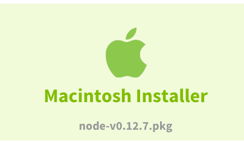

# setup-mean-ts

Instructions for how to set up a MEAN (MongoDB / Express.js / Angular.js / Node.js) + Typescript development environment on Mac, with free software.

You should have OSX Mavericks (10.9) or later.  
If you don't find the answers you need in these instructions, you may [find additional help here](http://bit.ly/19Fksyd).

## Install Google Chrome Web Browser
**Dependencies**: No dependencies. You may set up Chrome whenever you like.
We use [Google Chrome](https://www.google.com/intl/en/chrome/browser/), because it:

- Uses the Javascript V8 VM (which is used by Node.js).
- Integrates well with Google tools.
- Has a powerful Javascript debugger.

### JSON Viewer

The [JSONView](https://chrome.google.com/webstore/detail/jsonview/chklaanhfefbnpoihckbnefhakgolnmc?hl=en) Chrome extension allows viewing of JSON files directly in Chrome.

Complete the installation:

- Visit [chrome://extensions](chrome://extensions)
- Configure JSONView by checking **Allow access to file URLs**

Confirm the installation:  
Query the google maps servers for directions from Chicago to Los Angeles by clicking
[here](http://maps.googleapis.com/maps/api/directions/json?origin=Chicago,IL&destination=Los+Angeles,CA&waypoints=Joplin,MO|Oklahoma+City,OK&sensor=false),
then you should see nicely structured JSON in your browser.
The document should highlight structure as you move your mouse,
and it should collapse sections when you click on minus signs,
and expand sections when you click on plus signs.
 

### MarkDown Viewer

The [Markdown Preview](https://chrome.google.com/webstore/detail/markdown-preview/jmchmkecamhbiokiopfpnfgbidieafmd?hl=en) Chrome extension allows viewing of MarkDown files directly in Chrome.

Complete the installation:

- Visit [chrome://extensions](chrome://extensions)
- Configure Markdown Preview by checking **Allow access to file URLs**

Confirm the installation:
If you have a Markdown file on your local machine, locate it with Finder, then drag & drop it into Chrome.
It should display nicely formatted, as it would on Gitub.

## Install TextMate Editor
**Dependencies**: No dependencies. You may set up TextMate whenever you like.
Select version 2.* from [http://macromates.com/download](http://macromates.com/download)
Once it is downloaded, you must unzip it. You can do this from **Finder** (select the TextMat_*tbz file, then Menu-click, and choose open).
The app will be extract in place, so you must now move the TextMate.app file into your /Applications folder.


### Configure so tabs are set to 4 spaces for all text files.
Edit the default configuration file: **/Applications/TextMate.app/Contents/Resources/Default.tmProperties** so it contains:  

```
[ text ]
softWrap         = false  
softTabs         = true  
tabSize          = 4  
showInvisibles   = true
```

### Configure so whitespace is standardized upon file save.
#### Strip trailing whitespace from all lines
Open the bundle editor (⌃⌥⌘B) or "Bundles" → "Edit Bundles..."  
and open "Text" → "Menu Actions" → "Converting / Stripping" → "Remove Trailing Spaces in Document / Selection".  

Then in the drawer put:

- Scope Selector: **-text.html.markdown**  
  This setting causes TextMate to not strip trailing whitespace from MarkDown documents, since trailing whitespace is significant in MarkDown.
- Semantic Class: **callback.document.will-save**  
- Input: **Document**  
- Output: **Replace Document**  

These instructions were taken from the article [Strip trailing whitespace on Save with …callbacks!](http://tm2tips.tumblr.com/post/42657705618/strip-trailing-whitespace-on-save-with-callbacks)

#### Convert tabs to spaces upon file save.
Open the bundle editor (⌃⌥⌘B) or "Bundles" → "Edit Bundles..."  
and open "Source" → "Menu Actions" → "Convert Tabs to Space".  

Then in the drawer put:

- Scope Selector: -source.makefile
- Semantic Class: **callback.document.will-save**
- Input: **Document**
- Output: **Replace Document**

Confirm the installation:
Create a file with a ".txt" extension. Add a line of text with preceding tabs and ending with some spaces.
Save the file.
Confirm that the tabs have been converted to spaces, and that the trailing spaces have been removed.

Now do create a file with a "*.md" extension. Add a line of text ending with some spaces.
Save the file.
Confirm that the trailing spaces have NOT been removed.

#### Add file pathname to title bar.
Modify the following shell command to contain your home directory, then run it.  
It will add configuration to the TextMate config file for your user.

```
echo 'windowTitle    = "$TM_DISPLAYNAME${TM_DIRECTORY/\A(?:\/Users\/$USER\w+\/?(.*)|(.+))\z/${2:? – ${2/\A\/Users\/$USER/~/}:${1/\A(?=.)/ – /}}/}"' >> ~/.tm_properties
```

#### Exclude some directories from file search
Run this shell command to add this configuration to the TextMate config file for your user.

```
echo 'excludeInFolderSearch = "{$excludeInFolderSearch,$extraExcludes,node_modules,bower_components,generated,amd,commonjs,cache,doc}"' >> ~/.tm_properties
```

<a name="GitHub App"></a> 
## Install GitHub App
**Dependencies**: You must have a GitHub account. There are no dependencies on any other tools. You may set up the GitHub app whenever you like.
Get GitHub app from: [http://mac.github.com/](http://mac.github.com/)  
You should also have SSH keys. You can set them up by following this article: [https://help.github.com/articles/generating-ssh-keys](https://help.github.com/articles/generating-ssh-keys)

- Download
- Move app to Application folder  

- Follow instructions for configuration.


This should give you a functional GUI for managing your workspace with git.  
However, before you start using the workspace, you must finish the remaining configuration in these instructions.

## Install XCode and the Command Line Tools
**Dependencies**: XCode 5.0.2 requires OSX Mavericks/10.9.

You may set up Xcode whenever you like.
You can install XCode from the Apple App Store. Make sure get the correct version for your OSX version.  
We are using XCode 5.0.2 with OSX 10.9.

Once you have XCode installed, run it, and bring up the toolbar menu XCode -> Preferences,
and then on the Preferences panel, select the Downloads subpanel, click Components,
and install Command Line Tools. Or you can start the install from the command line:

```
xcode-select --install
```


## Install Node.js and Npm
**Dependencies**: No dependencies. You may set up Node.js and npm whenever you like.
Get Node.js from [http://nodejs.org/download/'](http://nodejs.org/download/), then find the button below on that page, and click it to download.  
  
This also installs npm, the node package manager.

### Configure so sudo isn't Required for Installs
Create a directory for globally installed npm packages, owned by your user, so that sudo isn't required:

```
sudo mkdir /usr/local/share/npm
sudo chown $user /usr/local/share/npm
sudo chmod 755 /usr/local/share/npm
````


Set the directory prefix for global packages:

```
echo prefix=/usr/local/share/npm >> ~/.npmrc
```

Add the following lines to your ~/.profile

```
echo 'export PATH="$PATH:/usr/local/share/npm/bin"' >>~/.profile
echo 'export NODE_PATH="/usr/local/share/npm/lib:./commonjs"' >>~/.profile
```

### Dependent Packages
We also need to install several support packages, globally, so they can be accessed from the command line, and by any project:

- Typescript  
We'll use [TypeScript](http://www.typescriptlang.org) whenever possible, because it adds strong typing to javascript.  
Use npm to install typescript:

   ```
   npm install -g typescript
   ```
- Test Framework  
Let's use [Mocha](http://visionmedia.github.io/mocha/) because it is flexible,
and karma to connect to browsers for the client.  
Use npm to install both:

   ```
   npm install -g mocha karma karma-mocha karma-requirejs karma-chrome-launcher karma-firefox-launcher
   (cd /usr/local/share/npm/bin ; ln -s ../lib/node_modules/karma/bin/karma )
   ```
- Source Debugger  
We'll use [Node Inspector](https://github.com/node-inspector/node-inspector/blob/master/readme.md) for source level debugging of node programs, including mocha tests.  
Use npm to install node-inspector:

   ```
   npm install -g node-inspector
   ```


**NOTE: skip this for now, as we don't use the express command from the command line**

- Web Development Framework  
We'll use [express](https://npmjs.org/package/express), because it provides simple routing.

  ```
  npm install express
  ```


## Install MarkDown Support
**Dependencies**: No dependencies. You may set up Mou whenever you like.

### Install Mou WYSIWYG Editor

Don't use a normal text editor for MarkDown (*.md) files. Your text editor may strip significant whitespace from your MarkDown documents.  
Instead, use [Mou.app](http://mouapp.com/).


## Install Bower Package Manager

See the Bower page: [http://http://bower.io/](http://http://bower.io/)

- Install

  ```
  npm install -g bower
  ```


## Install Brew Package Manager

See the Homebrew page: [http://brew.sh](http://brew.sh)

- Install

  ```
  ruby -e "$(curl -fsSL https://raw.github.com/Homebrew/homebrew/go/install)"
  ```
- Update the local indexes

  ```
  brew update
  brew doctor
  ```

## Install MongoDB
**Dependencies**: You must have brew, and XCode 5.0.2.  
**Reference**: [tutorial/install-mongodb-on-os-x](http://docs.mongodb.org/manual/tutorial/install-mongodb-on-os-x/)

You may set up MongoDB whenever you like.

Use Homebrew to install MongoDB:

```
brew update
brew install mongodb
```

Create the database storage directory:

```
sudo mkdir -p /mongo_data/play
sudo chown $USER /mongo_data/play
```

And to run mongo:

```
mongod --dbpath /mongo_data/play
```


# Install Java
- The Java JDK download link. This was hard to find (the JRE link was easy). To find this link I had to search for the name of the download file, in this case it was jdk-7u55-macosx-x64.dmg
[http://www.oracle.com/technetwork/java/javase/downloads/jdk7-downloads-1880260.html](Oracle's download site)

Add these lines to your ~/.profile:

```
export JAVA_HOME=/Library/Java/JavaVirtualMachines/jdk1.7.0_55.jdk/Contents/Home
export PATH=$PATH:$JAVA_HOME/bin
```


# Install CLOC - Count Lines of Code

This counts lines of code, and has many options.

- [Documentation](http://cloc.sourceforge.net/)
- [Download](http://sourceforge.net/projects/cloc/files/latest/download?source=files)


#### Install

**Dependencies**: No dependencies. You may set up cloc whenever you like.

After downloading, copy it to the /usr/local/bin directory,
and create a shell function to run cloc with the correct arguments.
Make sure you change the CLOC_VER variable below to match the version of what you downloaded.

```
CLOC_VER=1.60
sudo cp /Users/$USER/Downloads/cloc-$CLOC_VER.pl /usr/local/bin
sudo chmod +x /usr/local/bin/cloc-$CLOC_VER.pl
cat - >> ~/.profile << END
function cloc()
{
    cloc-$CLOC_VER.pl --force-lang-def=$HOME/.cloc.lang_def \$*
}
END
source ~/.profile
```

Create ~/.cloc.lang_def, and set its contents to:

```
HTML
    filter remove_html_comments
    filter call_regexp_common HTML
    extension htm
    extension html
    3rd_gen_scale 1.90
Javascript
    filter remove_matches ^\s*//
    filter call_regexp_common C
    filter remove_inline //.*$
    extension js
    extension json
    3rd_gen_scale 1.48
    end_of_line_continuation \\$
Typescript
    filter remove_matches ^\s*//
    filter call_regexp_common C
    filter remove_inline //.*$
    extension ts
    3rd_gen_scale 1.48
    end_of_line_continuation \\$
```


#### Examples
```
cloc schema src test  
cloc --exclude-lang=HTML,Javascript schema src test
```


# Install generateCodeVocabulary

This determines the symbols used in a collection of source files, and counts their use.

By keeping the generated vocabulary files for each version of code, changes can be verified before submitting code to your version control system.


#### Install

**Dependencies**: This uses CLOC.


This utility is part of this **setup-mean-ts** repo.
Copy the files to /usr/local/bin:

```
chmod +x generateCodeVocabulary.py
sudo cp generateCodeVocabulary.* /usr/local/bin
```

#### Examples
These commands are run as part of our **reports** target of make:

```
	generateCodeVocabulary.py --ext ts --out reports/client.vocabulary.json src/client
	generateCodeVocabulary.py --ext ts --out reports/server.vocabulary.json src/server
	generateCodeVocabulary.py --ext ts --out reports/test.vocabulary.json test
	-rm reports/all.vocabulary.json
	generateCodeVocabulary.py --ext vocabulary.json --out reports/all.vocabulary.json reports
```

